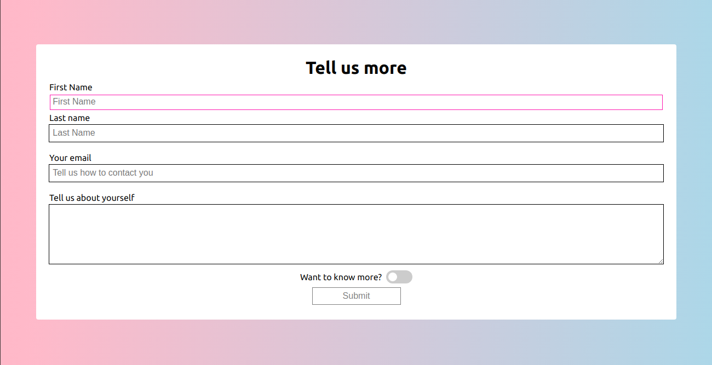
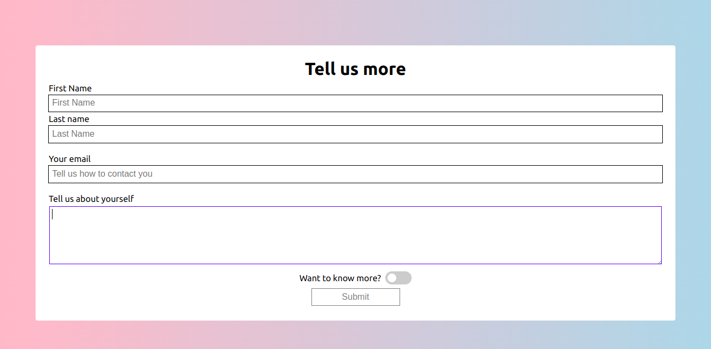
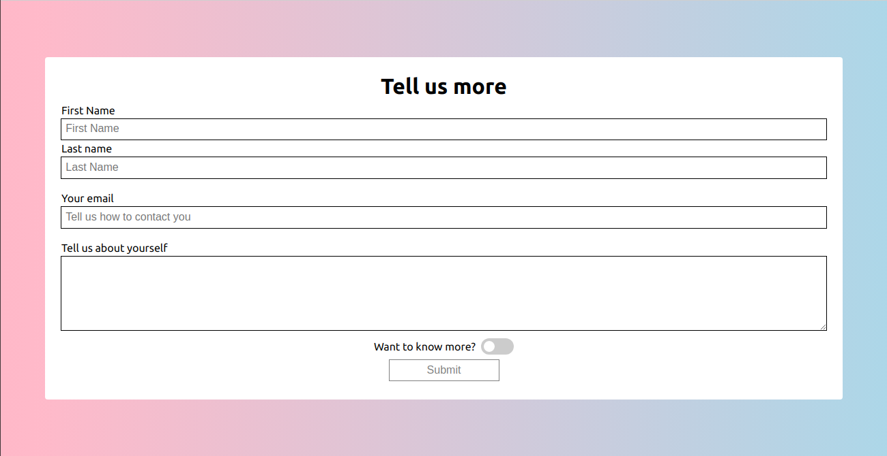
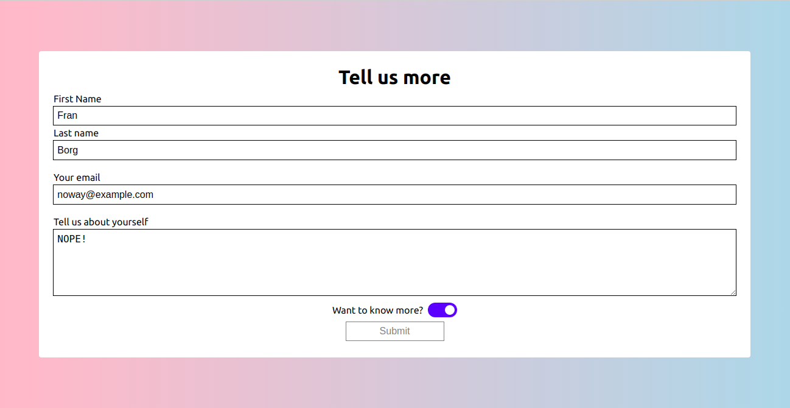

# Form Exercise- 3

Exercise about HTML Form elements

## Instructions

- Create a form as shown in the reference images below. The form should have four fields total:

  - First name
  - Last name
  - Email
  - Message

- The input fields with the type of "text" should have a PINK OUTLINE on focus. The input field with the type "email" and the text area should have a BLUE OUTLINE on focus. Make sure to select the inputs by type attribute when styling for focus.

- The form should also have a checkbox which is styled as a toggle switch.

- At the end of the form, there should be an input for submit. This input field should be DISABLED.

\*\* Rules

- The form should be responsive.
  

- For online version just [click...!](https://hsnakk.github.io/UIB_Data_Form_Exercise-3/)
